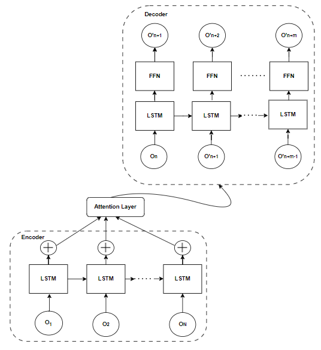
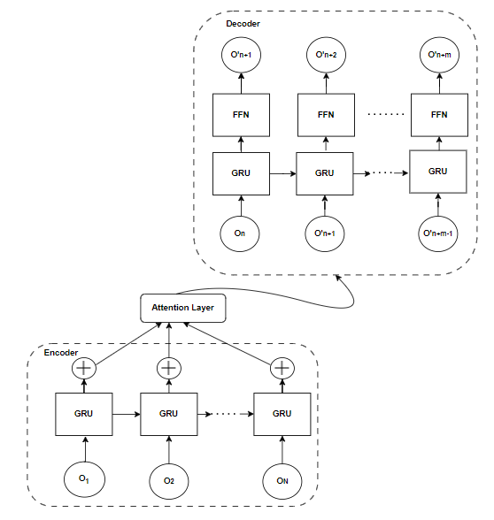

# Scientific Article Text Summarization

The scientific research process often begins with a
review of the state of the art, which may include a large number
of publications. Researchers would benefit from automatically
summarising scientific papers since it would speed up the study
process. Scientific text summarization plays a crucial role in
extracting relevant and concise information from large volumes
of scholarly articles. In this work deep learning techniques
are used to implement scientific articles summarization. Two
models namely, LSTM-Attention Encoder-Decoder Model and
GRU-Attention Encoder-Decoder Model are implemented and
compared. The LSTM-Attention Encoder-Decoder Model is performing better with a high ROGUE Score. This model is able
to generate summaries without compromising the essence of the
abstract provided.

## Tools
1) Google Colaboratory (GPU)
a) Language - Python   
b) Framework - Pytorch
## Dataset

In this work the SCI-TLDR dataset has been used for implementing scietific article summarization. It is an open sourced dataset provided in a CSV format. The dataset consists of 5400 TLDRS on the basis of 3200 research articles. Here only the dataset involving abstract and its summarizations are used. A total of 1992 train data samples, 619 test data sample and 620 validation data have been used. The input to the model are the abstract of the scientific research paper and the output is the summary of the abstract.

## Model Architecture
The LSTM Encoder-Decoder model with attention is a popular architecture used for sequence-to-sequence tasks in natural language
processing, such as machine translation and text summarization. The architecture is shown below.

The GRU Encoder-Decoder Model with attention works with the same principle as stated before. The only difference is that, instead of
LSTMs, GRUs are used. The architecture is shown below.

## Acknowledgements

 - [TLDR: Extreme Summarization of Scientific Documents](https://arxiv.org/abs/2004.15011)
 - [Dataset](https://github.com/allenai/scitldr)

